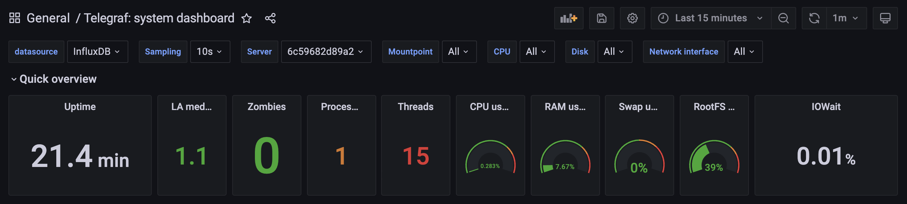
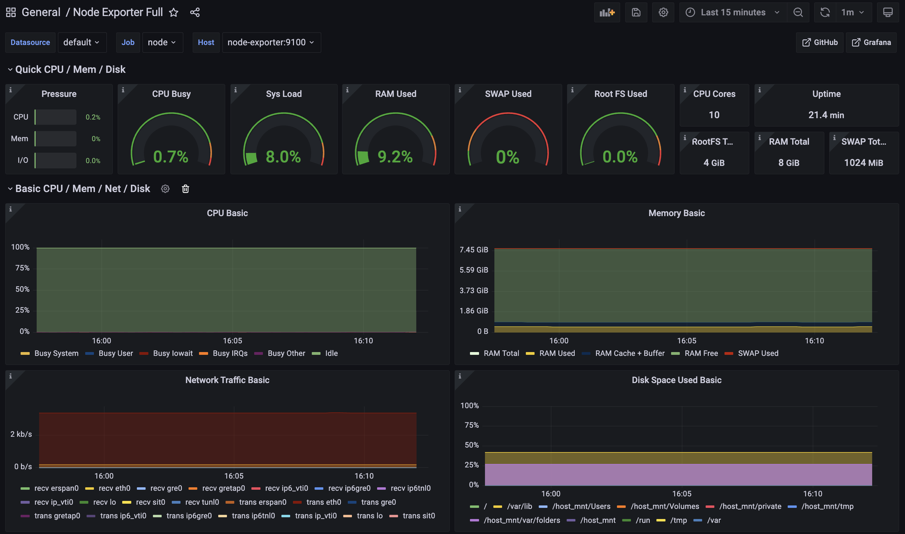

# Домашнее задание к лекции 2 «Подготовка стенда нагрузочного тестирования»

## Отчет о развертывании системы мониторинга на основе telegraf и influxDB

> * Агенты Telegraf самостоятельно записывают данные в базу.

### Сделано:

**1. Клонирование проекта:**
  * Склонирован [проект](https://github.com/netology-code/loadqa-homeworks/tree/main/2.Load%20environment/samples) и открыта папка `telegraf` в VSCode.
  * В файл `docker-compose.yml` добавлена строка `platform: linux/x86_64`, чтобы указать Docker создавать образы для архитектуры x86_64 (необходимо для работы на Apple M1 с архитектурой ARM).
  * Появлявшееся предупреждение о версии в `docker-compose.yml` удалось устранить путем удаления строки `version: '3.8'`, благодаря чему установлена более новая версия Docker Compose.  
    * В версиях Docker Compose 2.0 и выше больше не требуется указывать версию файла, так как композитор теперь автоматически обрабатывает данные. Это упрощает работу и делает файлы конфигурации более понятными.

**2. Запуск контейнеров:**
  * Запущен Docker-контейнер в фоне:
```bash
   docker compose up -d
```
  * Проверены запущенные контейнеры:
```bash
   docker ps
```

**3. Настройка Grafana:**
  * В браузере по адресу `localhost:3000` введены логин и пароль от Grafana, указанные в `docker-compose.yml`.
  * Соединена Grafana с базой данных:
    * Путь: Configuration => Data sources => Add data source => InfluxDB.
    * В настройках InfluxDB указано `URL: http://influxdb:8086`, который взят из блоков `links` и `ports` в `docker-compose.yml`.
    * Проверка соединения с помощью кнопки `Test`.

**4. Импорт Dashboard:**
  * Использован готовый Dashboard для анализа данных, найденный по запросу [telegraf dashboard grafana](https://grafana.com/grafana/dashboards/928-telegraf-system-dashboard/).
  * Скопирован ID дашборда и импортирован в Grafana:
    * Путь: Dashboards => Browse => Import => Скопированный ID => Load.

**5. Настройка метрик:**
  * Настроен мониторинг аппаратных метрик: оперативной памяти, swap, жесткого диска и сети.
  * В конфигурационном файле `telegraf.conf` в блоке `[inputs]` добавлен синтаксис для метрик `mem`, `swap`, `disk`, `net` с официального [GitHub Telegraf](https://github.com/influxdata/telegraf/tree/master/plugins/inputs).
  * Установлен интервал отправки метрик в 60 секунд:
```ini
   [agent]
   interval = "60s"
```

**6. Перезапуск контейнеров:**
  * Для применения настроек Telegraf выполнен перезапуск контейнеров:
```bash
   docker restart <название_контейнера_или_ID>
```

**7. Изменения в файле  docker-compose.yml:**
   * Для упрощения управления контейнерами добавлен параметр `container_name` в файл `docker-compose.yml`, что позволяет задавать собственные имена контейнеров.
   * Важно: После внесения изменений в файл docker-compose.yml, необходимо удалить существующие контейнеры и осуществить перезапуск, выполнив следующие команды:
```bash
   docker compose down
   docker compose up -d
```
 
**8. Скриншот состояния метрик:**
  * Сделаны [скриншоты](pictures) интерфейса Grafana, отображающего состояние метрик системы в покое длительностью 15 минут.



**9. Завершение работы и удаление контейнеров:**
  * Контейнеры остановлены и удалены с помощью команды:
```bash
   docker compose down
```

<br>

------

<br>

## Отчет о развертывании системы мониторинга на основе node-exporter и Prometheus.

> * Этот проект включает в себя интеграцию базы данных и агента для сбора метрик, использующими технологии node-exporter и Prometheus. Prometheus непосредственно инициирует запросы к node-exporter, который по умолчанию хранит метрики без необходимости дополнительной настройки, как это требуется в Telegraf. Основные настройки проводятся в конфигурационном файле prometheus.yml, где указываются интервалы опроса и список агентов для мониторинга.

### Сделано:

**1. Клонирование проекта:**
  * Открыта папка `prometheus` в VSCode из склонированного [проекта](https://github.com/netology-code/loadqa-homeworks/tree/main/2.Load%20environment/samples).
  * В файл `docker-compose.yml` добавлена строка `platform: linux/x86_64`, чтобы указать Docker создавать образы для архитектуры x86_64 (необходимо для работы на Apple M1 с архитектурой ARM).
  * Для упрощения управления добавлен параметр `container_name:` в `docker-compose.yml` для задавания собственных имен контейнеров.
  * Чтобы избежать предупреждение при запуске контейнеров о версии в `docker-compose.yml`  удалена строка `version: '3.8'`.  
    * В версиях Docker Compose 2.0 и выше больше не требуется указывать версию файла, так как композитор теперь автоматически обрабатывает данные. Это упрощает работу и делает файлы конфигурации более понятными.

**2. Установлен интервал отправки метрик:**
  * В файле `prometheus.uml` прописан интервал в 36 секунд:
```yaml
   global:
     scrape_interval:     36s
```

**3. Запуск контейнеров:**
  * Запущен Docker-контейнер в фоне:
```bash
   docker compose up -d
```
  * Проверены запущенные контейнеры:
```bash
   docker ps
```

**4. Настройка Grafana:**
  * В браузере по адресу `localhost:3000` введены логин и пароль от Grafana, указанные в `docker-compose.yml`.
  * Соединена Grafana с базой данных:
    * Путь: Configuration => Data sources => Add data source => Prometheus.
    * В настройках Prometheus указано `URL: http://prometheus:9090`, который взят из блоков `links` и `ports` в `docker-compose.yml`.
    * Проверка соединения с помощью кнопки `Save & test`.

**5. Импорт Dashboard:**
  * Использован готовый Dashboard для анализа данных, взятый с официального на сайта [Grafana Labs](https://grafana.com/grafana/dashboards/?search=Node+Exporter+Full).
  * Скопирован ID дашборда и импортирован в Grafana:
    * Путь: Dashboards => Browse => Import => Скопированный ID => Load.
  
**6. Скриншот состояния метрики:**
  * Сделан скриншот интерфейса Grafana, отображающего состояние метрик системы в покое длительностью 15 минут.



<br>

------

<br>

### Дополнительная информация
1. [Инструкция по работе систем мониторинга с `grafana`](https://grafana.com/docs/grafana/latest/getting-started/).
2. [Описание методологии сбора метрик](https://habr.com/ru/company/itsumma/blog/596845/).
3. [Описание моделей мониторинга](https://habr.com/ru/post/551264/).
4. [Описание подходов к логированию](https://habr.com/ru/post/551264/).
5. [Описание конфигурации тестового стенда](http://www.protesting.ru/automation/practice/test_stand_configuration.html).
6. [Подход к созданию тестового стенда](https://habr.com/ru/company/rtlabs/blog/577580/).